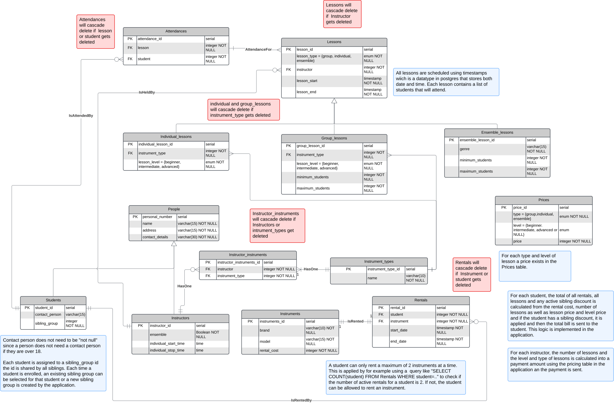

# Project-IV1351

The project for course IV1351 made by Project Group 96

The members of the group:

- Lukas Andersson
- John Elofsson
- Zakarias Fagerstedt

## Project file structure

The SQL script for building the database, [create_database.sql](/scripts/create_database.sql) is located in the scripts directory.

## Logical model

